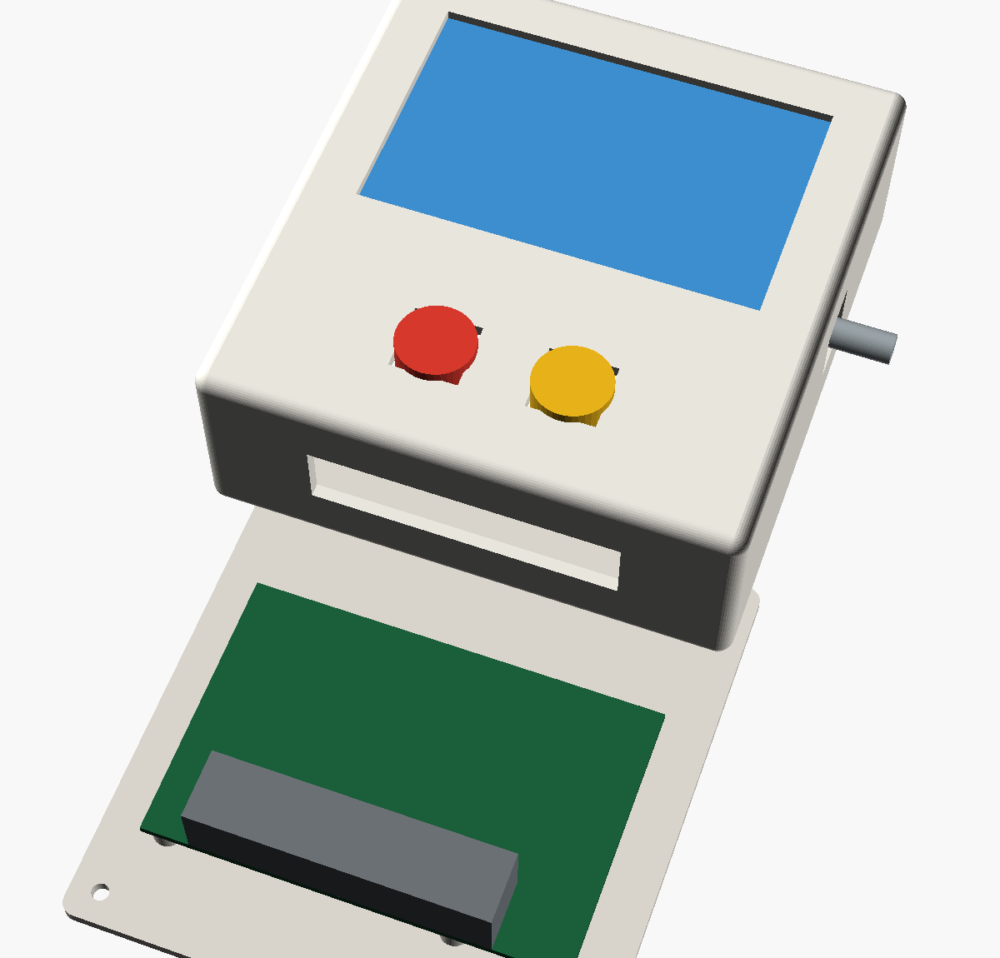
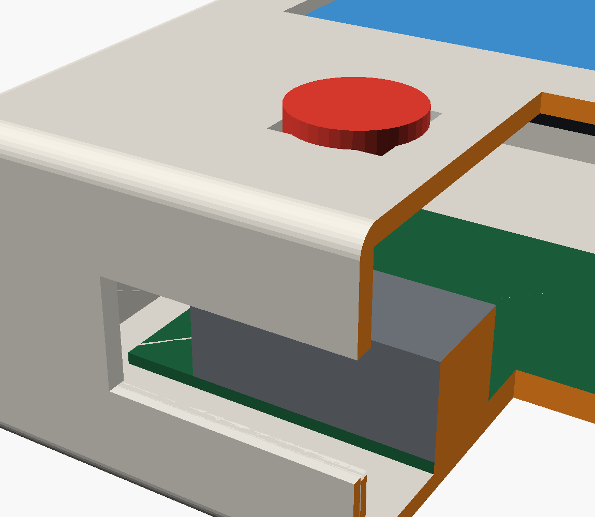

# ETH Arcade enclosure: CAD and printable files

These are the enclosure files for the landing page's **104 × 110 × 40 mm**
handheld: a deep front body and a shallow rear lid that press together without
screws. Start with the [complete build and wiring guide](../../BUILD-YOUR-OWN.md).

## Download the parts

On GitHub, open a file below and use **Download raw file** to save the actual
file. Do not save the GitHub HTML preview page as an STL. Cloning the repository
also gives you all of these files under `design/cad/`.

| Part | Print quantity | Slicer mesh | Alternate file |
|---|---|---|---|
| Front body: display window, buttons, side knob opening | 1 | [tick-body.stl](tick-body.stl) | [tick-body.3mf](tick-body.3mf) |
| Rear lid: speaker grille and press-fit tongue | 1 | [tick-lid.stl](tick-lid.stl) | [tick-lid.3mf](tick-lid.3mf) |
| Optional loose L-shaped board locator | As needed | [tick-bracket-l.stl](tick-bracket-l.stl) | [tick-bracket-l.3mf](tick-bracket-l.3mf) |
| Optional layout containing four locators | 1 layout for 4 brackets | [tick-bracket-l-x4.stl](tick-bracket-l-x4.stl) | [tick-bracket-l-x4.3mf](tick-bracket-l-x4.3mf) |

Choose either the single-bracket file or the four-bracket layout according to
how many mounts you need. The brackets are glued-in locators; the shell has
no fixed board mounting positions. A knob, electronics, and their mounting
hardware are not included in the two shell meshes.

## Inspect the assembly





More views: [front](front.png), [back](back.png), [open case](open.png),
[print layout](print-layout.png), and [locator bracket](bracket.png).
These are CAD previews, not proof of an assembled Pi Zero W fit.

## Edit the source

- [tick-case-3d.scad](tick-case-3d.scad): editable body, lid, optional brackets,
  and print/export views. Use this for changes to the printed parts.
- [tick-case-2d.scad](tick-case-2d.scad): dimensioned review drawing source.
- [tick-case-2d.png](tick-case-2d.png): rendered review drawing.

The 2D drawing includes older Pi 5 and screw-related annotations. The 3D body
and lid define the press-fit geometry; their mock Pi is also still a Pi 5-sized
placeholder. Measure your Zero W, connectors, and mounting clearances rather
than copying those board dimensions or connector comments.

Useful 3D source parameters:

| Parameters | What to measure before changing them |
|---|---|
| `W`, `H`, `D` | Overall case dimensions, including room for cables and battery |
| `WALL`, `FILLET` | Wall thickness and outside corner radius |
| `MOD_W`, `MOD_H`, `VIS_W`, `VIS_H` | Display module and visible image opening |
| `BTN`, `BTN_GAP`, `BTN_CY` | Switch opening size and position |
| `ENC`, `ENC_CY`, `ENC_CZ` | Encoder opening and shaft position |
| `HOLE_FACE`, `TOP_W`, `TOP_D` | Connector exit face and clearance |
| `SPLIT`, `LIP`, `LIP_T`, `CLEAR` | Body/lid joint and print clearance |

With OpenSCAD installed, run these commands **from the repository root** to
regenerate the body and lid after editing:

```sh
openscad -o design/cad/tick-body.stl -D 'VIEW="print_body"' design/cad/tick-case-3d.scad
openscad -o design/cad/tick-lid.stl -D 'VIEW="print_lid"' design/cad/tick-case-3d.scad
```

For the optional bracket files:

```sh
openscad -o design/cad/tick-bracket-l.stl -D 'VIEW="print_bracket"' design/cad/tick-case-3d.scad
openscad -o design/cad/tick-bracket-l-x4.stl -D 'VIEW="print_brackets"' design/cad/tick-case-3d.scad
```

These commands update the STL files only. Existing 3MF files and preview
images will not automatically reflect your source changes.

## Print and fit

1. Import the body and lid meshes into your slicer in **millimetres**. Check
   the assembled target dimensions of 104 × 110 × 40 mm; do not scale the
   whole case to fix a local switch or connector mismatch.
2. Use the intended orientations: body front face down, lid rear face down
   with its tongue pointing up. The source provides these export views.
   Inspect the layer preview before printing; the geometry is intended to
   print without supports.
3. Choose settings for your printer and filament. No printer-specific,
   physically validated print profile is supplied. Test the joint and
   openings first; nominal clearance is 0.3 mm.
4. Dry-fit the screen, switches, encoder, speaker, battery, and Pi with their
   cables attached. Add insulating mounts and load-bearing locators so the
   boards do not move when you press a button or turn the knob.
5. Complete the [bench wiring checks](../../BUILD-YOUR-OWN.md#5-wire-and-check-the-controls)
   with the lid off. Keep wiring outside the tongue/socket path, then gently
   press the lid on. Correct interference instead of forcing the shell shut.

The battery/charging and speaker electronics still require component-specific
selection and mounting. Their physical fit and the final Zero W assembly are
not verified by these printable files.
