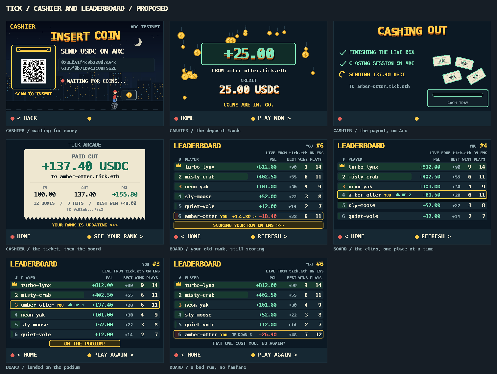
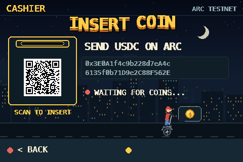
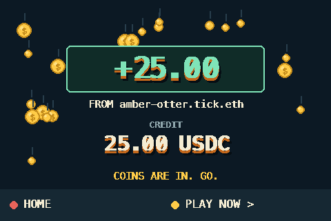
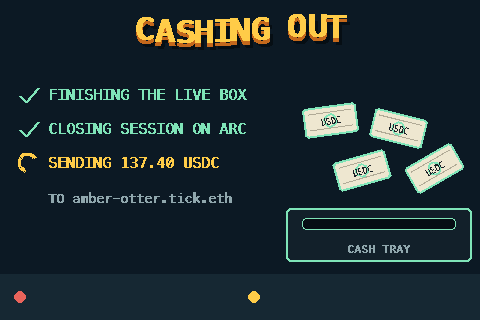
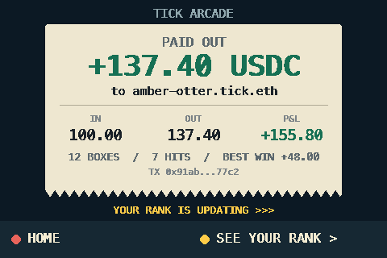
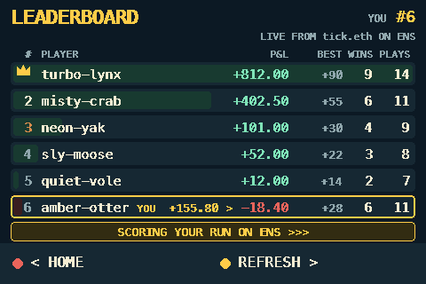
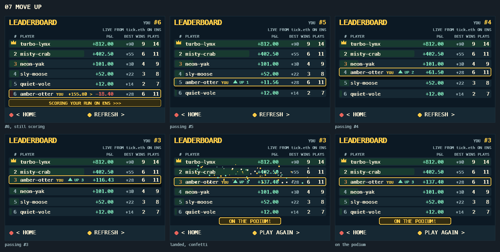
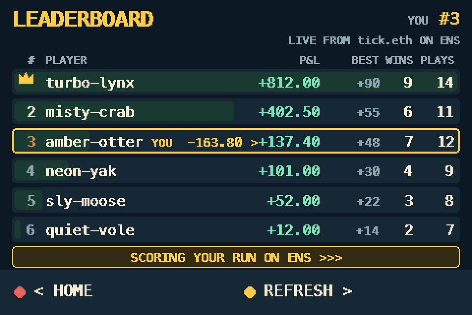
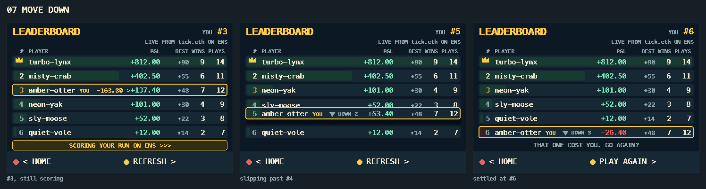

# INSERT COIN — the money and leaderboard flow

Arcade rules: you put a coin in, the machine gives you credit, you play, and
when you walk away the machine pays you and moves your name on the board.

Mockups drawn at the real 480x320, using the game's own palette, fonts and
night-city background. Proposals, not running firmware. Regenerate with:

```
cd design/insert-coin && ../../firmware/.venv/bin/python make_mockups.py
```



---

## 1. I am on home and I want to play

I pick the money button and press A.



One QR code in a coin-slot bezel, `SEND USDC ON ARC`, `WAITING FOR COINS...`,
the address. That is everything. No cash-out wording, no balance, no house
rules — none of that applies until money is in. The game's own city is behind
it and the kid is parked on the street, waiting for someone to pay.

## 2. The money lands



Coins rain, the credit counts up, the yellow button says **PLAY NOW**.

## 3. I press A and I am in the game

No detour through home. *(Today it drops me on the launcher with PLAY selected;
going straight in is the change.)* If I press nothing for 3 seconds it falls
back to home with PLAY selected, so nothing is forced on me.

## 4. I finish and I want my money

I press the money button, which already reads `CASH OUT · 137.40` on the
launcher. There is **no in-between screen** — the press starts the payout.



Three steps tick off while Arc confirms, and paper money flies out of the cash
tray. The wait becomes the show instead of a status line.

## 5. The machine prints my ticket



In, out, P&L, boxes played, the tx. It reads `YOUR RANK IS UPDATING`, and after
2.5 seconds it takes me to the leaderboard by itself (or A goes now).

---

## 6. The board moves, one place at a time

I arrive still sitting at my **old** rank, with my pending result ghosted beside
my row and a strip saying the score is still landing.



> The scores live on ENS and the scorekeeper only writes them once the escrow
> closes, so there is a real few-second gap. The board holds the old picture
> and polls every 3 seconds instead of 20 rather than hiding it.

Then I climb **one row at a time** — not a jump. Each step is its own beat:
my plate lifts, the row above slides under me, the numbers roll, `UP 1` becomes
`UP 2` becomes `UP 3`, and my P&L counts up the whole way.




Land on the podium and the machine celebrates: confetti off the plate, the
medal colour, `ON THE PODIUM!`.

If the run went badly, the same movement runs downward and **nothing
celebrates** — the rows slide, a grey `DOWN 3`, and a line that just asks if I
want to go again.





Two cases worth their own moment, not drawn yet:

- **first ever run** — no old rank, so my row drops in from the top and stamps
  down as `NEW ENTRY`.
- **outside the visible six** — my row stays pinned at the bottom (it already
  does today) and the number itself counts `#12 → #9`, then flies up into the
  list if the climb carries me into it.

---

## The loop

```
   HOME ──A on the money button──► INSERT COIN
    ▲                                   │ deposit lands
    │                                   ▼
    │                              COIN DROP ──A = PLAY NOW──► BOX RUN
    │                                                             │
    │                                        A on the money button│
    │                                                             ▼
    │                                                        PAYING OUT
    │                                                             ▼
    │                                                         RECEIPT
    │                                                             │ A, or 2.5s
    └──────────────── B ───────────────────────────────── LEADERBOARD
                                                   old rank ▸ climb ▸ celebrate
```

---

## What changed from the last pass

- **Cut the bank page.** The screen that showed a big balance with the QR
  demoted to a chip is gone. Cash out fires from the launcher's money button,
  which already carries the balance.
- **Cut the podium still.** The celebration is the end of the movement, not a
  screen of its own.
- **The move is step-by-step**, one rank per beat, up or down, instead of a
  single swap.
- **Insert coin is a scene**, not a form: city, street, waiting rider, and only
  two lines of copy. The `10 USDC = ONE BOX` and `MAX WIN 5x` lines are gone.

## One thing to decide

Cutting the bank page means pressing the money button mid-session **sends a real
transaction with nothing in between**. That is fine if the press is deliberate,
but it is now the only screen-less irreversible action on the device. Either:

- leave it (fastest, matches how the button reads today), or
- make `PAYING OUT` start with a half-second `CASH OUT 137.40?` beat that a
  second press confirms — no extra page, just a beat at the top of the payout.

[SPEC.md](SPEC.md) has the implementation detail: which existing `ArcFunding`
field drives each screen, the animation timings, and the seven things the code
does not track yet — chiefly that the board must remember your previous rank and
hold the new rows back until the movement runs.
