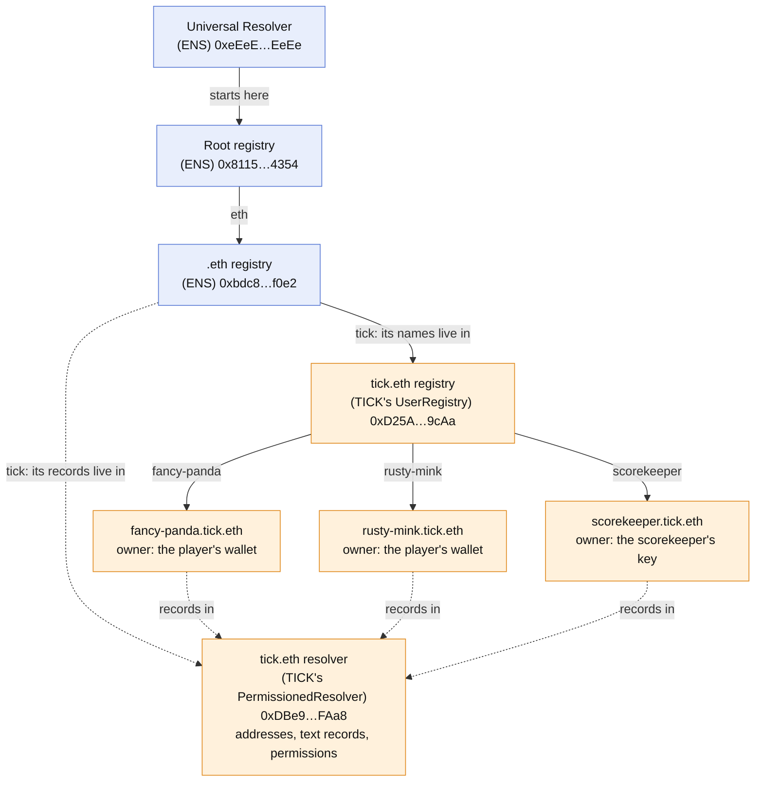
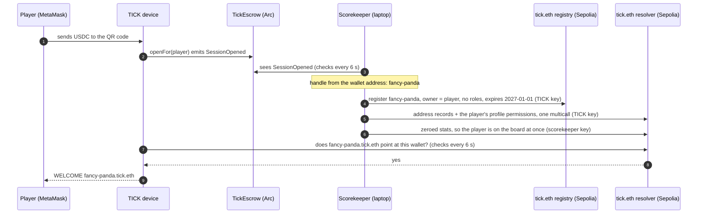
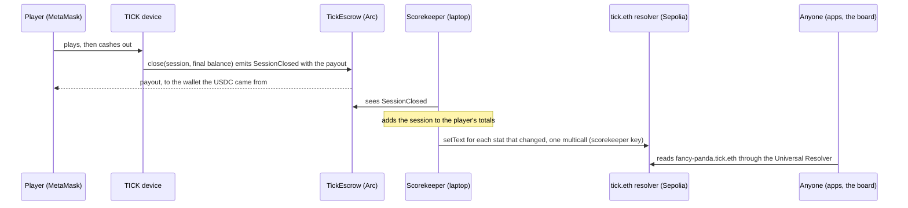

# ens — a name for every player, and the leaderboard on the names

Every wallet that plays TICK with real USDC gets a name, `<handle>.tick.eth`, on **ENSv2** (Sepolia beta). The player's stats are text records on that name, and the leaderboard is read back from ENS alone. The money stays on Arc; nothing changes for the player.

## What the player does

Exactly what they did before: scan the QR code, send USDC from MetaMask, play, cash out to the same wallet. They never touch Sepolia, never need ETH there, never sign anything and never pick a name. Everything below happens around them.

## How ENS is laid out, and where TICK sits

ENSv2 is built from two kinds of contract:

- A **registry** holds one level of names. For each label it records who owns it, which resolver answers for it, and which registry holds the names under it. `.eth` is a registry, and in ENSv2 any name can have its own registry for its subnames.
- A **resolver** holds a name's records (its addresses and text records) and answers questions about them. ENSv2's `PermissionedResolver` also decides, record by record, who may change each one.

On top of them, ENS runs the **Universal Resolver**: the one contract apps ask. It starts at the root, follows the registries down to the name, finds that name's resolver and asks it.

TICK added one registry and one resolver, both copies of ENS's own contracts made through ENS's `VerifiableFactory`, and hung them under `.eth` as `tick.eth`:



Blue is ENS's own infrastructure; orange is what TICK owns. Asking for `fancy-panda.tick.eth`'s `tick.pnl` goes: Universal Resolver → root → `.eth` (the `tick` entry points at TICK's registry) → TICK's registry (the `fancy-panda` entry names the resolver) → the resolver, which returns the record. Any ENS app or library that resolves names this way reads TICK's players with no TICK code.

Every name shares the one resolver, and the resolver enforces who may write what. That is ENSv2's Enhanced Access Control on-chain, not a rule in our code:

| | `tick.*` stats | profile (`avatar`, `description`, `url`, `com.twitter`) | address records | transfer the name |
|---|---|---|---|---|
| **scorekeeper** | yes, on every name: one grant per key, made once at setup | no | no | — |
| **player** | no | yes, on their own name | no | no: names are issued without the transfer role |
| **TICK key** | admin | admin | yes | — |

So a player cannot touch their own score, and the scorekeeper cannot touch anyone's profile or address. Player names expire when the season ends (2027-01-01).

## A player's first session

Nothing about ENS needs the player. Their deposit on Arc is the signal:



What gets written to ENS, once per wallet:

| Where | What | Written by |
|---|---|---|
| tick.eth registry | the label `fancy-panda`, owned by the player's wallet, answered by TICK's resolver, expiring at season end. No roles, so it cannot be transferred and its resolver cannot be changed | TICK key |
| resolver | the Ethereum address record (coin type 60) = the player's wallet | TICK key |
| resolver | the Arc address record (ENSIP-11 coin type `0x804cef52`) = the same wallet | TICK key |
| resolver | permission for the player to write `avatar`, `description`, `url` and `com.twitter` on this name only | TICK key |
| resolver | `tick.sessions` … `tick.best` = `0` | scorekeeper |

The handle comes from the wallet address (two words picked by its hash), so a wallet always gets the same name without an index. If that handle already belongs to another wallet, it gets `-2`, then `-3`. A new player's name shows on the device about half a minute after their deposit. A returning player's shows within seconds, because nothing needs registering.

## Every session after that

Only a finished session changes the score. A deposit from a player who already has a name writes nothing to ENS.



On every close, the scorekeeper updates the player's name like this:

| Record | Change on each close |
|---|---|
| `tick.sessions` | +1 |
| `tick.wins` | +1 if the payout beat the deposit |
| `tick.deposited` | + the session's deposit |
| `tick.paid` | + the session's payout |
| `tick.pnl` | `tick.paid - tick.deposited`: what the leaderboard ranks by |
| `tick.best` | the best single session so far, net |
| `tick.last_tx` | this session's close transaction on Arc |

For example, `rusty-mink.tick.eth`'s first session deposited 0.04 USDC and cashed out 0.045 ([close on Arc](https://testnet.arcscan.app/tx/0x97c982d75198b90af0f29a7cc1e05a49e7283e06c28c851d5e8724078f04bfaf)). Its name went from zeros to `tick.sessions=1`, `tick.wins=1`, `tick.deposited=0.04`, `tick.paid=0.045`, `tick.pnl=0.005`, `tick.best=0.005`, and `tick.last_tx` pointing at that close ([stats tx on Sepolia](https://sepolia.etherscan.io/tx/0x5e93cabcc92da633c1bf9ebbf82bef0265359b0745fe594fa23327d3a7b86ceb)).

Every number comes from TickEscrow's own `SessionOpened`, `SessionClosed` and `SessionReclaimed` events on Arc, so anyone can recompute it. A reclaimed session, where the player took the deposit back after a timeout, counts as a session that broke even. Only the stats that changed are written, in one transaction per player.

## The leaderboard

The board reads ENS alone. It lists every name in the tick.eth registry from its `LabelRegistered` events, then reads each name's `tick.*` records through the Universal Resolver in one batched call per name (`resolve(name, multicall(text…))`), and ranks by `tick.pnl`. Names without stats, such as `scorekeeper.tick.eth`, are left out. The code is `Standings` in [`firmware/names.py`](../firmware/names.py). `ens/scorekeeper.py board` prints it, and a web page can do the same with any ENS library.

The device shows the same board: **LEADERS** on the home screen ([`firmware/screens/board.py`](../firmware/screens/board.py)) lists the top seven with P&L, best session, wins and plays. Whoever is playing on the device, or was just paid out, gets a lit row with a `YOU` tag: in place if they're in the top seven, otherwise on their own row at the bottom with their rank, or as "ranked after cash out" before their first session is scored. It reads on its own thread, every 20 s while the board is on screen and not at all otherwise, and asks only for new registry blocks each time. That is one block-number call, a log call and one resolver call per player, so the Pi needs no relay.

## Run

Use the firmware's venv. The TICK key is `ARC_DEPLOYER_KEY` in `contracts/.env`; the scorekeeper's key is created in `ens/.tick/` (gitignored).

```sh
firmware/.venv/bin/python ens/scorekeeper.py deploy   # once; needs ~0.05 Sepolia ETH on the TICK key
firmware/.venv/bin/python ens/scorekeeper.py run      # alongside the device, while people play
firmware/.venv/bin/python ens/scorekeeper.py board    # the leaderboard, through ENS's Universal Resolver
firmware/.venv/bin/python -m unittest discover -s ens # the scorekeeper's arithmetic
```

`deploy` registers `tick.eth` through the ENSv2 `ETHRegistrar` (commit, wait a minute, register; paid in the registrar's test USDC), deploys the registry and resolver, links the registry to `.eth`, creates `scorekeeper.tick.eth`, grants it the stats keys and sends it 0.01 ETH for gas. It prints the registry and resolver addresses for `firmware/names.py`.

`run` follows TickEscrow on Arc from its first block, names every player it has not named yet (TICK key), and writes the stats that changed (scorekeeper key, one multicall per player). Restarting it is safe: it recomputes everything and writes only what differs from ENS.

Nobody has to remember to start it: `firmware/main.py` starts one beside the game ([`firmware/keeper.py`](../firmware/keeper.py)) and stops it on the way out. It is one service, not one per device — it holds the TICK key, so two of them would race to register the same name — so it starts only on the machine whose `contracts/.env` has `ARC_DEPLOYER_KEY`, only for real-money play, and only once per machine (an `flock` on `ens/.tick/scorekeeper.lock`). Its output goes to `ens/.tick/scorekeeper.log`. Set `TICK_SCOREKEEPER=0` to keep the game from starting one and run it by hand instead. Without it the money still works; the leaderboard just has nobody new on it.

### Scoring from the Pi

Two files travel by hand, the same way `firmware/.tick/device.json` does. Both, or neither — `contracts/.env` alone names players and then fails to score them:

```sh
scp contracts/.env             pi@tick.local:~/ethonline2026/contracts/.env
scp ens/.tick/scorekeeper.json pi@tick.local:~/ethonline2026/ens/.tick/scorekeeper.json
```

`ARC_DEPLOYER_KEY` is the escrow's `owner()`: it can `withdraw` the whole house, pause play and change the limits, on top of owning `tick.eth`. On the Pi it is only as safe as the Pi. The handheld does not need it to play — `device.json` alone opens and closes sessions — so copy it only when the Pi is the machine that has to keep score.

The launcher says on startup which of the two it is missing, and plays on without one either way. A missing `scorekeeper.json` is refused rather than created: `load_device` would mint a fresh account with no gas and none of the resolver roles, and every stats write would revert in a retry loop while players still got their names.

## Files

| Path | What |
|---|---|
| [`scorekeeper.py`](scorekeeper.py) | `deploy`, `run` and `board`: everything that writes to ENS |
| [`test_scorekeeper.py`](test_scorekeeper.py) | The stats arithmetic, without a network |
| [`../firmware/keeper.py`](../firmware/keeper.py) | Starts one scorekeeper beside the game, on the machine that holds both keys |
| [`../firmware/names.py`](../firmware/names.py) | The device's side: handles, namehash, and looking a player's name up. It lives in `firmware/` because the device runs it, as `firmware/arc.py` is the device's side of [`contracts/`](../contracts/) |

The device looks names up on the Arc worker thread ([`firmware/arc.py`](../firmware/arc.py), `ArcFunding.names`) and shows them in BOX RUN ([`firmware/games/box.py`](../firmware/games/box.py), `BoxGame.who`). ENS being slow or down never delays the money: the device keeps showing the short address.

## Deployed (Sepolia)

Two chains, two explorers:

| Chain | What lives there | Explorer |
|---|---|---|
| Ethereum Sepolia (11155111) | The names and their stats | [sepolia.etherscan.io](https://sepolia.etherscan.io) |
| Arc testnet (5042002) | The money: USDC sessions in [TickEscrow `0x4FA3…8627`](https://testnet.arcscan.app/address/0x4FA3D366A08aD06D60A0aB141FFb9981EDeE8627), unchanged by any of this | [testnet.arcscan.app](https://testnet.arcscan.app) |

Where to look:

- **Every stats update** is a `TextChanged` event on the resolver: open its page below, then the **Events** tab.
- **Every new player** is a `LabelRegistered` event on the registry.
- **One game end to end:** a player's last Arc session (in [The first players](#the-first-players)) settles on Arc first. Their stats transaction on Sepolia follows, with `tick.last_tx` set to that same Arc transaction.

| What | Address |
|---|---|
| `tick.eth` owner, the TICK key | [`0x7ee85B080701330bf53Be62B7E72fcDD034eCCac`](https://sepolia.etherscan.io/address/0x7ee85B080701330bf53Be62B7E72fcDD034eCCac) |
| `tick.eth` registry (`UserRegistry` proxy) | [`0xD25ACD4eB42A40D8145E3A7F1feFB17D09649cAa`](https://sepolia.etherscan.io/address/0xD25ACD4eB42A40D8145E3A7F1feFB17D09649cAa) |
| Resolver for every `tick.eth` name (`PermissionedResolver` proxy) | [`0xDBe98b10176aBf0BD2DFEE86fD3ee59A7630FAa8`](https://sepolia.etherscan.io/address/0xDBe98b10176aBf0BD2DFEE86fD3ee59A7630FAa8) |
| `scorekeeper.tick.eth` | [`0xc5402E5A9D63b39A735a7b0B5b9F3338C1439CD9`](https://sepolia.etherscan.io/address/0xc5402E5A9D63b39A735a7b0B5b9F3338C1439CD9) |

Both proxies come from ENS's own `VerifiableFactory` and implementations (ENSv2 beta, [deployments](https://docs.ens.domains/learn/deployments)); TICK wrote no contract of its own for this. The registry and resolver were deployed from block 11684278.

### Setup, transaction by transaction

| Step | From | Tx |
|---|---|---|
| Deploy the resolver (`VerifiableFactory.deployProxy`) | TICK key | [`0xf605…c19e`](https://sepolia.etherscan.io/tx/0xf605cf6fa56884518782ea7c786208fa9b29225a5a7295b3c16ecaf4a9a4c19e) |
| Deploy the registry (`VerifiableFactory.deployProxy`) | TICK key | [`0x94ad…c9a5`](https://sepolia.etherscan.io/tx/0x94adc5dd4a68e45001923cfffa0f7f0f1795745c741c64ee1b497f2f72e5c9a5) |
| Mint the registrar's test USDC | TICK key | [`0x0f15…9648`](https://sepolia.etherscan.io/tx/0x0f155f105bc147f34d1f1b370af56b3cc219a975f3379b9cc72257090f6f9648) |
| Approve the registrar to take it | TICK key | [`0x388a…e6fe`](https://sepolia.etherscan.io/tx/0x388ab7b744902747121d829d4119349381787fe718bccdc6844ff34b49ede6fe) |
| Commit to `tick.eth` (`ETHRegistrar.commit`) | TICK key | [`0xfacb…c241`](https://sepolia.etherscan.io/tx/0xfacb56dd6040eff014c2796b970e99d3c4cfe0dd3510393e70c9c2b49d3ec241) |
| Register `tick.eth` with our registry and resolver (`ETHRegistrar.register`) | TICK key | [`0x26b6…be8d`](https://sepolia.etherscan.io/tx/0x26b6c4dac2e485b3e2689960ada55ac7b61151ddd2ce34f80cb2f6890b83be8d) |
| Link the registry under `.eth` (`setParent`) | TICK key | [`0xd0fc…b336`](https://sepolia.etherscan.io/tx/0xd0fcf0168dd8203b8b2b0306b24ec7275895fdffc4a277c3d4b81c1eeebda336) |
| Register `scorekeeper.tick.eth` | TICK key | [`0xc2c6…623f`](https://sepolia.etherscan.io/tx/0xc2c6b075a48202e1cdd627a12ac1b455c6ad7d49402f4104eb15228a293c623f) |
| Records for `tick.eth` and the scorekeeper, and its grant on the seven `tick.*` keys (one `multicall`) | TICK key | [`0x148f…b700`](https://sepolia.etherscan.io/tx/0x148fe47260eaca9295419b0d83cc9f06fdafed18a2b946d0d50245960355b700) |
| 0.01 ETH to the scorekeeper for gas | TICK key | [`0xd91d…0b2d`](https://sepolia.etherscan.io/tx/0xd91de6fecc723bfd969bdfe42e9f4e011daac12f680375922a30207eb5880b2d) |

### The first players

The first `run` found the two wallets that had played on Arc testnet and named them. Each player takes three transactions: the name, its address records and profile grants, then the stats, written by the scorekeeper.

| Player | Wallet | Name | Records | Stats | Last Arc session |
|---|---|---|---|---|---|
| `rusty-mink.tick.eth` | `0x7ee8…eCac` | [`0xfe05…27f0`](https://sepolia.etherscan.io/tx/0xfe059f6a7bbdb0d960991c52a30cc7fa939f9f244ee83148564b75a9020227f0) | [`0x3f2c…0f1c`](https://sepolia.etherscan.io/tx/0x3f2c0f9f031d0750e59d6e874edda105e9321573f8e1ce7dec8a19dcaafe0f1c) | [`0x5e93…6ceb`](https://sepolia.etherscan.io/tx/0x5e93cabcc92da633c1bf9ebbf82bef0265359b0745fe594fa23327d3a7b86ceb) | [`0x97c9…bfaf`](https://testnet.arcscan.app/tx/0x97c982d75198b90af0f29a7cc1e05a49e7283e06c28c851d5e8724078f04bfaf) |
| `fancy-panda.tick.eth` | `0x0Dd7…696f` | [`0x1a62…26ae`](https://sepolia.etherscan.io/tx/0x1a6280ed3040c76891ea3494b6d6825edffd40be541e15eedeff079e29d926ae) | [`0xbce2…280a`](https://sepolia.etherscan.io/tx/0xbce2b307c724548c3382f2e2b17a7c61a0dc25ca5807db9f8e5ad7a47233280a) | [`0x2af0…b1a4`](https://sepolia.etherscan.io/tx/0x2af088ba3c0e2a355ac99d6ea1d70215760be0b637644c4c05903d1e2e10b1a4) | [`0x8e4d…15d5`](https://testnet.arcscan.app/tx/0x8e4d1b79c80d1307e8d08f51020ea884c1a5a6710430b8d5d7cf5347f92b15d5) |
